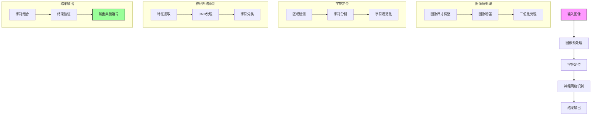

## 流程说明

1. **图像预处理**
   - 调整图像尺寸至标准大小
   - 进行图像增强，提高对比度
   - 图像二值化处理

2. **字符定位**
   - 检测集装箱号所在区域
   - 分割单个字符
   - 对字符进行规范化处理

3. **神经网络识别**
   - 提取字符特征
   - 使用CNN进行处理
   - 进行字符分类识别

4. **结果输出**
   - 组合识别后的字符
   - 验证结果的正确性
   - 输出最终的集装箱号